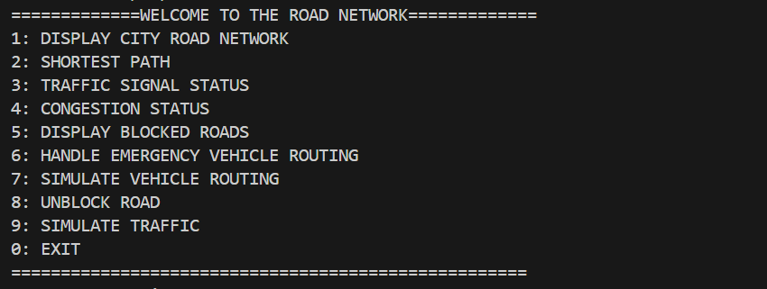
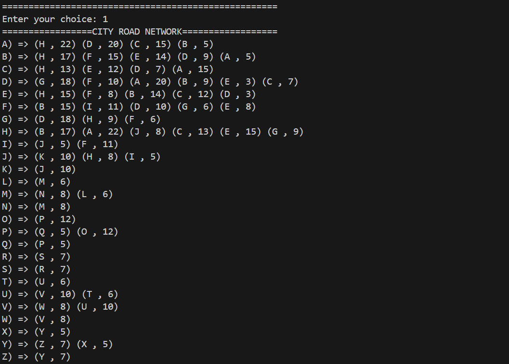
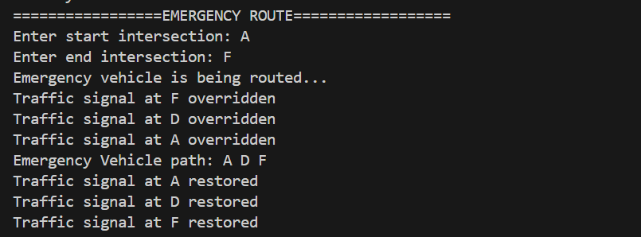
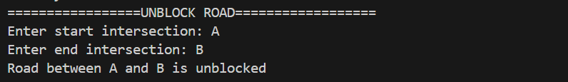

# Smart Traffic Management System Simulator  

🚦 **Version**: 1.0  

---

## 📑 Table of Contents  

1. [Introduction](#-introduction)  
2. [Features](#-features)  
3. [System Workflow](#-system-workflow)  
4. [Technology Stack](#-technology-stack)  
5. [Project Setup](#-project-setup)  
6. [Sample Outputs](#-sample-outputs)  
7. [Deliverables](#-deliverables)  
8. [Contributors](#-contributors)  
9. [License](#-license)  

---

## 📖 **Introduction**  

Welcome to the **Smart Traffic Management System Simulator**! 🚦 This cutting-edge **C++ project** is designed to **simulate real-world traffic flow** in urban environments, optimizing traffic management and handling congestion efficiently. 

The system integrates **advanced data structures** and **algorithms** to ensure:

- **Smooth traffic flow** even during peak hours.
- **Dynamic congestion resolution** by analyzing and adjusting to real-time traffic conditions.
- **Efficient handling of emergencies**, providing fast routes for emergency vehicles and minimizing delays.

The simulator is a perfect blend of **intelligent routing**, **real-time data analysis**, and **traffic management** innovation, transforming how cities manage their road networks. 🌆

---

## 🚀 Features

### 🌆 City Traffic Network
- 📊 **Graph-based Infrastructure**: Represents intersections and roads as nodes and edges using adjacency lists.
- ➕ **Dynamic Management**: Add or remove roads and intersections as needed.

### 🚗 **Vehicle Routing**
- 📍 **Optimized Navigation**: Calculates the shortest path using **Dijkstra’s Algorithm**.
- 🚦 **Real-time Vehicle Tracking**: Tracks vehicle movements across the network during simulation.

### 🚦 **Traffic Signal Management**
- ⏱️ **Dynamic Green Timing**: Adjusts signal durations based on vehicle density at intersections.
- 🛑 **Priority Overrides**: Clears paths for emergency situations by overriding traffic signals.

### 🚨 **Congestion Monitoring**
- 🔢 **Live Vehicle Count**: Tracks vehicle density at each intersection using **Hash Tables**.
- 🔍 **Smart Detection**: Detects congestion based on vehicle counts and handles road closures using **BFS/DFS**.

### 🆘 **Emergency Vehicle Handling**
- 🛤️ **Priority Pathfinding**: Finds the fastest route for emergency vehicles using **A* Search Algorithm**.
- ✅ **Traffic Recovery**: Restores normal traffic flow once emergencies are resolved.

### 🚧 **Accident & Road Closure Simulation**
- ⚠️ **Real-time Disruption Management**: Handles accidents or road closures dynamically.
- 🛑 **Impact Analysis**: Analyzes disruptions caused by accidents or closures and adjusts traffic flow accordingly.

---

## 📜 System Workflow

### 1. **Initialization**: 🚦
- 🚗 **Data Loading**: Load road, vehicle, and traffic signal data from CSV files.
- 🗺️ **Network Setup**: Automatically set up the road network, intersections, and routes for simulation.

### 2. **Traffic Simulation**: 🛣️
- 🕹️ **Real-Time Monitoring**: Continuously monitor traffic and update vehicle routes to ensure smooth flow.

### 3. **Signal Management**: 🚦
- ⏱️ **Adaptive Signal Timing**: Adjust light timings dynamically based on vehicle density at intersections.
- 🔄 **Traffic Flow Adjustment**: Automatically modify signal durations to optimize traffic flow and reduce congestion.

### 4. **Emergency Handling**: 🚨
- 🚑 **Fast-Track Routes for Emergencies**: Override traffic signals to prioritize emergency vehicles.
- 🚧 **Route Optimization**: Use advanced algorithms to ensure the fastest routes for emergency vehicles.

### 5. **Monitoring & Logging**: 📊
- 📈 **Real-Time Data Logging**: Log vehicle movements, signal timings, and congestion levels for performance analysis.
- 🔍 **Detailed Monitoring**: Continuously track vehicles, signals, and road conditions for operational insights.

---

## 🛠️ Technology Stack

### **Programming Language**: 💻
- **C++**: Object-oriented programming for high-performance simulations.

### **Data Structures**: 📊
- **Graphs**: Used for modeling intersections and roads, enabling efficient pathfinding.
- **Priority Queue**: Optimizes vehicle routing and dynamic signal management.
- **Hash Tables**: Facilitates real-time tracking of vehicle density and congestion.

### **Key Algorithms**: 🧠
- **Dijkstra’s Algorithm**: For calculating the shortest paths and optimizing vehicle routing.
- **A* Search**: For prioritizing and optimizing routes for emergency vehicles.
- **BFS/DFS**: Efficient algorithms for detecting congestion and handling road closures.

---

## 📂 Project Setup  

### Clone the Repository  
```bash  
git clone <https://github.com/tahainam555/Traffic-Management-System.git>  
cd <rTraffic-Management-System>   
  
```  

### Compile the Code  
Use any C++ compiler (e.g., GCC):  
```bash  
g++ -o traffic_simulator main.cpp  
```  

### Run the Program  
```bash  
./traffic_simulator  
```  

### 📂 Input Files  
To run the Smart Traffic Management System, make sure the following CSV files are placed in the **working directory**:

- **`road_network.csv`**: Contains the details of the city's road network (intersections and road connections).
- **`vehicles.csv`**: Lists the vehicles in the system, including their start and end points.
- **`traffic_signals.csv`**: Holds the traffic signal timings for each intersection.
- **`emergency_vehicles.csv`**: Details emergency vehicles, their priority levels, and routes.
- **`road_closures.csv`**: Provides information on road closures and blocked routes.

💡 **Tip**: These files are crucial for the system to simulate traffic flow, handle emergencies, and adjust signals dynamically!

---

## 📦 Deliverables  

### 🔑 **Key Deliverables**  

- **Source Code**: Clean, well-documented, and modular code structure for easy understanding and maintenance.  
- **Simulation Scenarios**:  
    - 🚗 **Normal Traffic Flow**: Simulates a regular day-to-day traffic scenario.  
    - 🌆 **Peak-Hour Congestion**: Models heavy traffic conditions during rush hours.  
    - 🚨 **Emergency Vehicle Routing**: Handles priority routing for emergency vehicles with optimized paths.  
    - 🚧 **Accident or Road Closure Handling**: Simulates road disruptions and manages traffic flow during accidents or closures.

- **Performance Metrics**:  
    - ⏱️ **Average Vehicle Travel Time**: Measures the efficiency of the system in terms of vehicle movement.  
    - ⚡ **Signal Adjustment Efficiency**: Evaluates how effectively the system adapts traffic signal timings to optimize flow.  

🎯 **Objective**: These deliverables showcase the system’s ability to manage real-world traffic challenges efficiently while providing real-time insights!
 
---

# 📊 Output Demonstrations  

Below are the output visuals demonstrating various functionalities of the **Smart Traffic Management System Simulator**.

---

## 🗂️ **Main Menu**  
Here’s the user-friendly main menu that provides easy access to all system features.  



---

## 🚗 **Shortest Path Calculation**  
The system efficiently calculates the shortest path between two intersections using **Dijkstra’s Algorithm**.  



---

## 🚧 **Blocked Roads**  
Blocked roads are dynamically handled, and the road network is updated accordingly.  


---

## 🚦 **Traffic Signal Status**  
Displays the current signal timings and dynamically adjusts them based on traffic density.  


---

## 📈 **Congestion Monitoring**  
Monitors vehicle density at each intersection and highlights congested areas in real-time.  


---

## 🚨 **Emergency Vehicle Routing**  
Prioritizes emergency vehicles by finding the fastest path using **A* Search Algorithm** and clears intersections.  



---

## 🔓 **Unblock Roads**  
Users can unblock previously closed roads, and the system restores the original traffic flow.  



---

## 👨‍💻 **Contributors**  

This project is brought to life by the talented team of:  
- **Hamda Shahid** 🚀  
- **Minahil Rizwan** ✨  
- **Muhammad Taha** 🖥️  

Guided by the exceptional instructors at the **National University of Computer & Emerging Sciences, Islamabad Campus** 🌟  

---

## 📢 **License**  

This project is developed for **educational purposes only** and follows the **Honor Policy** of the institution to promote academic integrity. 📚  
All rights reserved for **non-commercial use only**.


